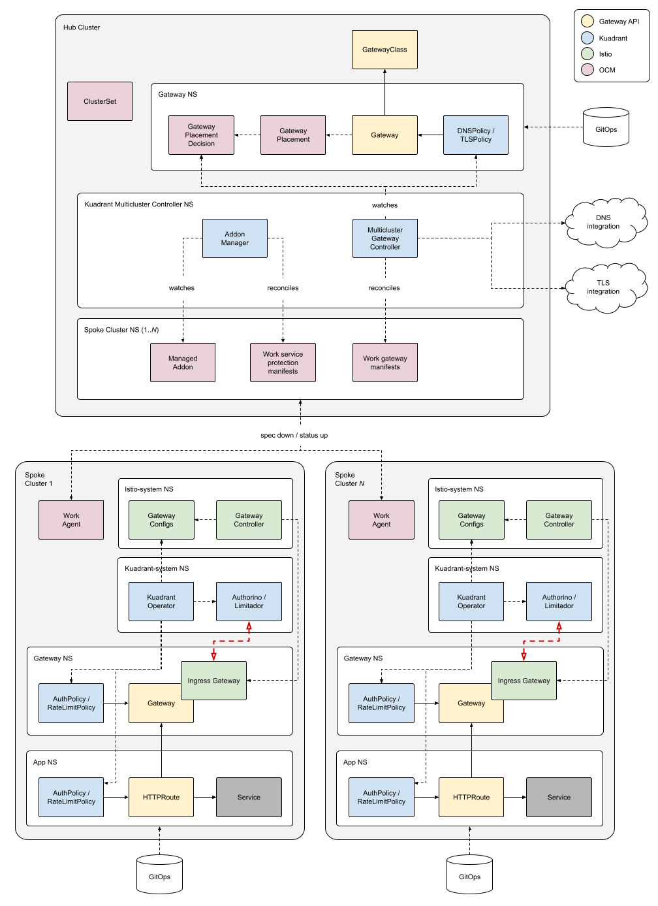

# Overview

Kuadrant brings together [Gateway API](https://gateway-api.sigs.k8s.io/) and [Open Cluster Management](https://open-cluster-management.io/) to help you scale, load-balance and secure your Ingress Gateways as a key part of your application connectivity, in the single or multi-cluster environment.

# Getting Started
To quickly get started with Kuadrant locally, see our **Getting Started** guides for the [Single Cluster](getting-started-single-cluster.md) or [Multi Cluster](getting-started-multi-cluster.md) use cases.

## Single-cluster

Kuadrant can be used to protect ingress gateways based on [Gateway API](https://gateway-api.sigs.k8s.io/)[^1] with policy enforcement (rate limit and auth) in a Kuberentes cluster.

[^1]: <b>Supported implementations:</b> <a href="https://istio.io/">Istio</a>, <a href="https://www.redhat.com/en/technologies/cloud-computing/openshift/what-is-openshift-service-mesh">OpenShift Service Mesh</a>.

  
Topology

  

## Multi-cluster

In the multi-cluster environment[^2], you can utilize Kuadrant to manage DNS-based north-south connectivity, which can provide global load balancing underpinned by your cluster topology. Kuadrant's multi-cluster functionality also ensures gateway and policy consistency across clusters, focusing on critical aspects like TLS and application health.

[^2]: Based on <a href="https://open-cluster-management.io/">Open Cluster Management</a>.

  
Topology

  

## Component Documentation

* [Kuadrant Operator](/kuadrant-operator) 
  Install and manage the lifecycle of the Kuadrant deployments and core Kuadrant policies for the data plane.
* [Authorino](/authorino) 
  Flexible, cloud-native, and lightweight external authorization server to implement identity verification (Kubernetes TokenReview, OIDC, OAuth2, API key, mTLS) and authorization policy rules (Kuberentes SubjectAccessReview, JWT claims, OPA, request pattern-matching, resource metadata, RBAC, ReBAC, ABAC, etc).
* [Limitador](/limitador) 
  Fast rate-limiter implemented in Rust, that can be used as a library, or as a service plugged in to the API gateway.
* [Multicluster Gateway Controller](/multicluster-gateway-controller) 
  Manage multi-cluster gateways, integrate with DNS providers, TLS providers and OCM (Open Cluster Management).
